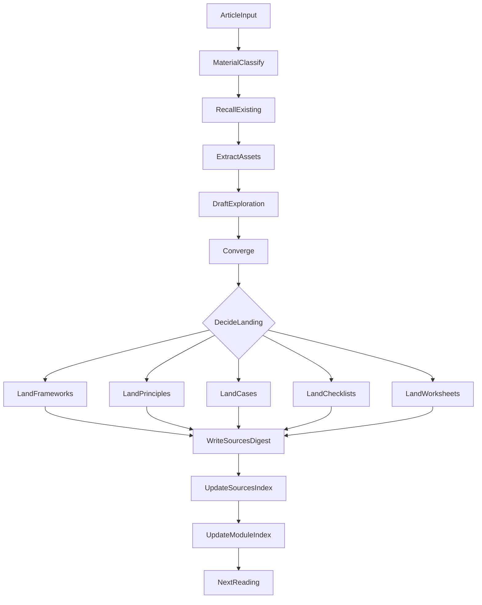
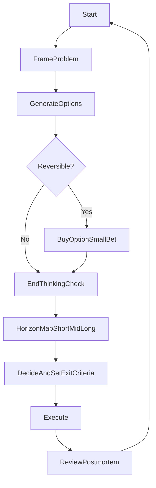

# Choice Handbook（选择手册）

> 极限的思索，是把自己推到边界：看见“本来可以发生的”，也看见“为何没发生”。  
> 尽头常在远方，有时候却是现实——它不是终点，而是一个坐标：你站在这里，才会知道自己身处何时何地，究竟在追什么，又究竟遗忘了什么、错失了什么。  
> 因此我们探究尽头：不是为了更漂亮的叙事，而是为了在选择之前先看清代价，在行动之后仍能回到现实，把喜悦与疼痛都纳入复盘，逼近那个“其实可以更好”的自己。

> 目标：把“做更好的选择”变成一套**可证伪 / 可退出 / 可复盘**、可长期迭代的系统。  
> 核心信念：**选择质量（方向与乘数）长期大于努力强度（执行与燃料）**。

---

## 快速开始（只看这一段就够）

1) **先看蒸馏层入口**：`distilled/README.md`  
2) **需要“年代参照系”时**：`distilled/yearbook/README.md`（2000–2025 年度复盘：短版入口）  
3) **直接从“机会图谱”进入**：`distilled/opportunity_map.md`（Top 候选：Gate / 最短探针 / 停机点）  
4) **需要强结论时**：`distilled/high_certainty_decisions.md`（强烈推荐/强烈不推荐 + 退出/重启条件）  
5) **想看完整推理与上下文**：去对应的 `world_understanding/*.md`（每条结论都有证据锚点与回写）
6) **不知道该用哪个框架时**：看 `frameworks/README.md` 的“框架路由（默认顺序）”

---

## 按目标阅读（更省脑）

- **你正在做一个现实选择（职业/关系/项目/学习）**：从 `worksheets/decision_one_pager.md` 开始，用一页卡落地  
- **你想训练“尽头 + 退出条件”的能力**：读 `frameworks/03_end_thinking_tangnuo.md`  
- **你要把“观点”升级成“系统”**：读 `distilled/life_choice_operating_system.md`  
- **你给我新文章/线索，想把它变成可用结论**：看下面的“文章处理工作流”
- **你要用 Case Atlas 做类比门禁**：先看 `world_understanding/yearbook/README.md` 的“统一应用方法”，按 **速用索引 → Tripwire/Bound/Spiral → 最短探针** 落地

---

## 建议阅读路线（Suggested Reading Path，传统线性版）

### 入门（先能用）
1. `principles/01_choice_over_effort.md`：先把“选择 vs 努力”的边界说清楚  
2. `worksheets/decision_one_pager.md`：直接用一页卡做一次真实决策  
3. `frameworks/03_end_thinking_tangnuo.md`：加入“尽头坐标”，写出退出条件

### 进阶（把决策质量做高）
1. `frameworks/01_decision_quality.md`：用“过程质量”替代“结果执念”  
2. `frameworks/04_horizon_map.md`：短/中/长期利益的统一视角  
3. `frameworks/02_opportunity_and_option_value.md`：机会成本与期权价值（保留选择）
4. `frameworks/05_reasoning_toolkit.md`：推理工具箱（材料→结构→推演→行动）

### 熟练（用案例训练直觉）
- 进入 `cases/`：每个案例都带“尽头 + 退出条件 + 下一步实验”

---

## 核心入口

| 模块 | 链接 | 说明 |
|---|---|---|
| **原则** | `principles/README.md` | 选择观、价值与边界 |
| **框架库** | `frameworks/README.md` | 可复用的决策模型与方法 |
| **世界理解** | `world_understanding/README.md` | 对世界/技术/机制的解释模型（趋势/范式/路线） |
| **练习表单** | `worksheets/README.md` | 可复制填写：one-pager / premortem / postmortem |
| **案例库** | `cases/README.md` | 跨场景训练：职业/关系/健康/金钱/项目 |
| **清单** | `checklists/README.md` | 高频场景：跳槽/合作/学习路径/项目选择等 |
| **材料库** | `sources/README.md` | 外部材料 digest（可回查，避免编造） |
| **证据联结** | `meta/README.md` | 猜想注册表 + 决策日志：新证据验证旧猜想，升级确定性 |
| **蒸馏层** | `distilled/README.md` | 给人看的精华入口：核心猜想 + 高确定性决策 |
| **年度复盘** | `distilled/yearbook/README.md` | 2000–2025 年度参照系：短版入口（长版在 `world_understanding/yearbook/`） |

---

## 关于“尽头”（引用）

> “极限的思索让我们箭一样射向远方，但注视它实际上的力竭停止之处，转而追究它‘本来可以发生却为什么没发生’、‘已堪堪发生却退回去复归不会发生’，则让我们老老实实落回此时此地来，这比较迫切，也有更多不舒服的真相，尤其是人自身的真相。  
>  
> 事物在此一实然世界的确实停止之处，我称之为尽头。在这里，一次一次的，最终，总的来说，揭示的是人的种种真实处境。”——唐诺

## 文章处理工作流（Article Processing Workflow）

当你给我一篇文章时，我会把它变成“四层资产”（你在 GitHub 上一眼能找到）：

- **sources/**：可回查 digest（锚点/定义/变量/机制/预测/不确定性）  
- **world_understanding/**：完整推理与 Gate 分析（T0-Now/T0-Analog/Endgame/探针/停机点）  
- **meta/**：猜想注册表/决策日志（让新证据能验证旧猜想并升级确定性）  
- **distilled/**：给人看的结论（结论+证据锚点+反证信号+下一步）



### 你会得到什么（默认交付）

- **1 个 digest**：`sources/YYYY-MM-DD_xxx.md`
- **1 个 world_understanding 主文**：`world_understanding/xxx.md`  
  - 默认用 01/02/03/04/05 做“短而密”的推理与落地  
  - 若用户点名 06 / 要 BTC 式强结论 / 新 repo 分析 → 必须按 `frameworks/06_time_travel_endgame_simulator.md` 固定标题输出（标题不可省）
- **1 条可证伪猜想（或更新旧猜想）**：写入 `meta/hypotheses_registry.md`
- **1 条蒸馏结论入口**：更新 `distilled/opportunity_map.md`（必要时也更新 `distilled/core_hypotheses.md`）
- **联结检查（小门禁）**：至少命中 1 条旧 `H-XXXX`（支持/反对/不确定三选一），并把交叉链接回写到 `meta/hypotheses_registry.md`（让新证据能升级旧猜想）

## 写作视角说明（Future Historian / 未来回看者）

这个手册默认用一种“更有趣但更负责”的写法：

- **像未来研究员在写**：允许更强的镜头感与叙事，但关键推演必须落回：**事实/假设/推演标签** + **可回归信号** + **下一步行动**。
- **像站在当时的人身上回看历史**：写清“当时的年代背景、当时能看到什么/看不到什么、当时有哪些可选路径与代价”，并显式区分“当时信息”与“事后上帝视角”。
- **追求更确定的未来**：不靠玄学，靠“机制不变量 + 约束 + 信号”，用 20%/50%/80% 的确定性阶梯持续更新。

## 一句话总流程（你每次做选择都能照做）



---

## 项目结构

```
choice-handbook/
├── README.md
├── AGENT.md
├── sources/
├── principles/
├── frameworks/
├── world_understanding/
├── worksheets/
├── cases/
└── checklists/
```

---

## 使用建议（避免变成鸡汤）

- **每一篇都必须落到行动**：至少一个下一步实验（小成本验证/访问/试运行）；Plan Prompt 仅在需要更长执行指令时才写（否则链接到 `AGENT.md` 模板）。
- **每一个选择都必须写“退出条件”**：何时停止、止损、停机点，以及重启条件。
- **用“尽头”把你拉回现实**：看清资源、约束、代价与人自身的真实处境。
- **让新证据升级确定性**：当新高可信材料验证/反证旧猜想时，要更新 `meta/hypotheses_registry.md` 与 `meta/decisions_log.md` 并回写双向链接。

