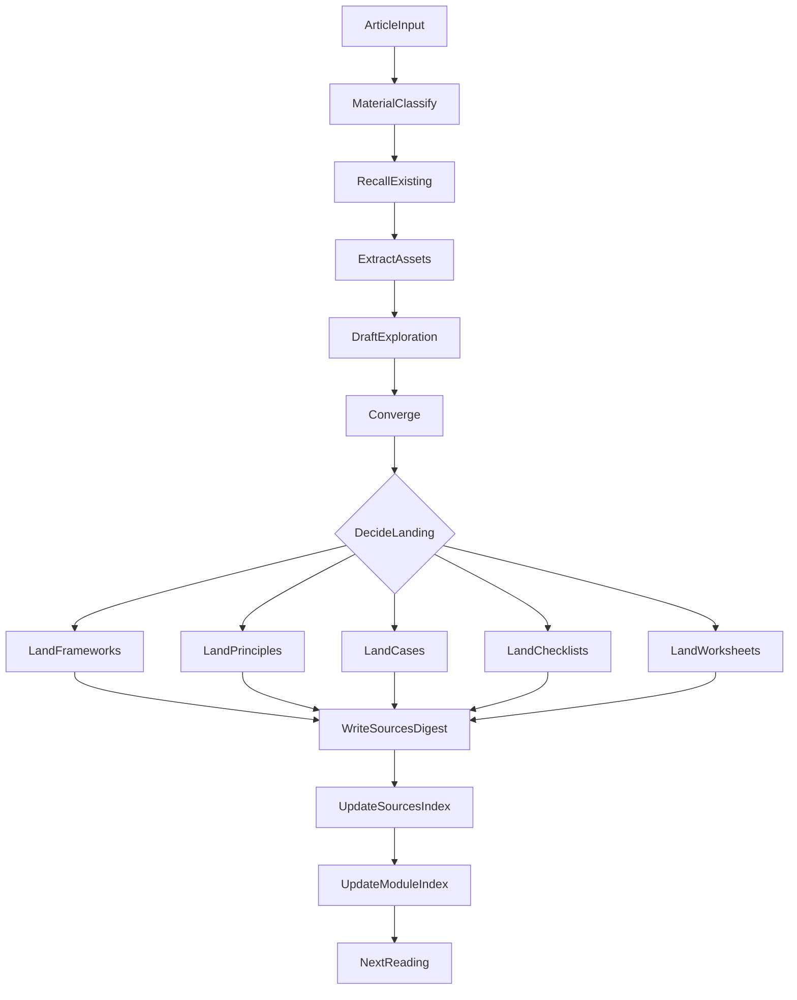
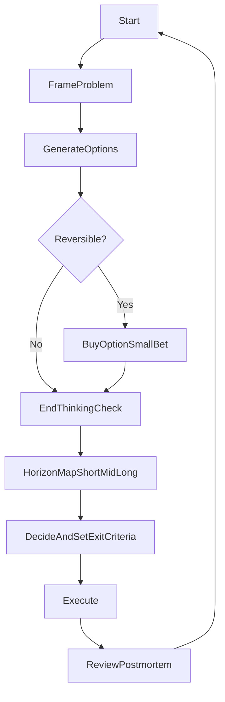

# Choice Handbook（选择手册）

> 目标：把“做更好的选择”变成一套可练习、可复盘、可长期迭代的系统。
>
> 核心信念：**选择质量（方向与乘数）长期大于努力强度（执行与燃料）**。

---

## 建议阅读路线（Suggested Reading Path）

### 入门（先能用）
1. `principles/01_choice_over_effort.md`：先把“选择 vs 努力”的边界说清楚  
2. `worksheets/decision_one_pager.md`：直接用一页卡做一次真实决策  
3. `frameworks/04_end_thinking_tangnuo.md`：加入“尽头坐标”，写出退出条件

### 进阶（把决策质量做高）
1. `frameworks/01_decision_quality.md`：用“过程质量”替代“结果执念”  
2. `frameworks/02_horizon_map.md`：短/中/长期利益的统一视角  
3. `frameworks/03_opportunity_and_option_value.md`：机会成本与期权价值（保留选择）
4. `frameworks/05_comparative_thinking.md`：比较思考（发展史/类比/当下与未来）

### 熟练（用案例训练直觉）
- 进入 `cases/`：每个案例都带“尽头 + 退出条件 + 下一步实验”

---

## 核心入口

| 模块 | 链接 | 说明 |
|---|---|---|
| **原则** | `principles/README.md` | 选择观、价值与边界 |
| **框架库** | `frameworks/README.md` | 可复用的决策模型与方法 |
| **练习表单** | `worksheets/README.md` | 可复制填写：one-pager / premortem / postmortem |
| **案例库** | `cases/README.md` | 跨场景训练：职业/关系/健康/金钱/项目 |
| **清单** | `checklists/README.md` | 高频场景：跳槽/合作/学习路径/项目选择等 |

---

## 文章处理工作流（Article Processing Workflow）

当你给我一篇文章时，我会把它“读入 → 回看旧内容 → 提炼 → 落盘 → 复盘”，并把产出放到最合适的位置（`frameworks/`/`cases/`/`checklists/`/`worksheets/`/`principles/`），同时沉淀一份 `sources/` digest 以便后续回查。



## 一句话总流程（你每次做选择都能照做）



---

## 项目结构

```
choice-handbook/
├── README.md
├── AGENT.md
├── principles/
├── frameworks/
├── worksheets/
├── cases/
└── checklists/
```

---

## 使用建议（避免变成鸡汤）

- **每一篇都必须落到行动**：至少一个下一步实验（小成本验证/访问/试运行）。
- **每一个选择都必须写“退出条件”**：何时停止、止损、停机点，以及重启条件。
- **用“尽头”把你拉回现实**：看清资源、约束、代价与人自身的真实处境。

